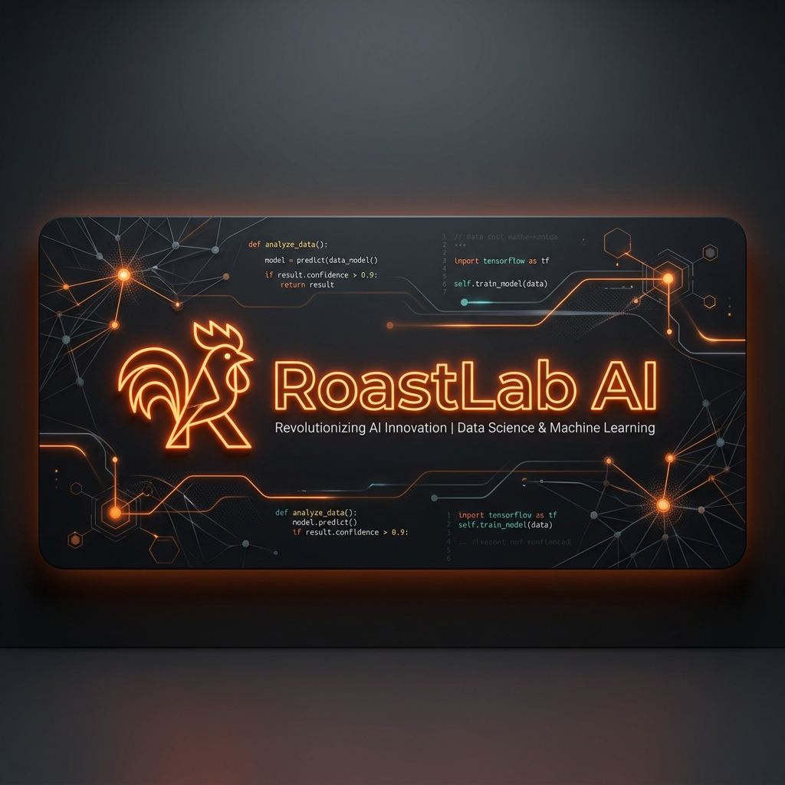
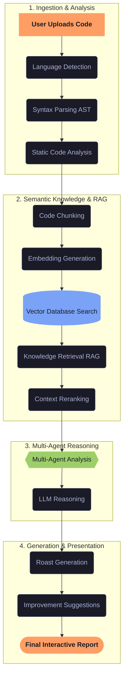

# 🔥 RoastLab AI

### *Your code gets roasted. You get better.*

---

## 📖 Overview

RoastLab AI is an AI-powered code review platform that combines Large Language Models (LLMs), Retrieval-Augmented Generation (RAG), Natural Language Processing (NLP), static code analysis, and multi-agent AI to provide humorous yet actionable code reviews. Instead of acting as a traditional code reviewer, RoastLab AI analyzes source code using multiple AI agents, retrieves relevant programming knowledge from trusted documentation, detects code quality issues, and generates creative, personality-driven feedback while still providing accurate technical recommendations. The primary goal is to make learning software engineering more engaging by combining entertainment with professional code analysis.

---

## 🚀 Core Features

*   **AI-Powered Code Review:** Get instant, personality-driven reviews that highlight syntax, styling, performance, and architecture issues.
*   **Multi-Agent AI Architecture:** Specialized agents analyze different aspects of the code independently before synthesizing a final review.
*   **Retrieval-Augmented Generation (RAG):** Contextualizes feedback with references and insights extracted from official programming documentation.
*   **NLP & Language Detection:** Automatically identifies the coding language and extracts semantic context using state-of-the-art NLP models.
*   **Static Code Analysis Integration:** Seamlessly combines linting and static analysis results from tools like Ruff, Roslyn, and ESLint with AI analysis.
*   **Interactive Roast Reports:** Rich reports displaying a code quality score, security analysis, performance suggestions, and customized jokes.
*   **Extensible Plugin Architecture:** Write custom agents, integrate new analyzers, or configure unique reviewer personalities.

---

## 🛠️ How It Works

RoastLab AI coordinates static analysis, semantic retrieval, and agent orchestration. The diagram below details the end-to-end pipeline from when a developer uploads code to the generation of the final interactive report:

---

## 🤖 AI Architecture

The system employs a collaborative multi-agent architecture where specialized AI agents inspect code in parallel. This design isolates specific concerns and ensures high accuracy in both security detections and creative comedy.

| Agent | Focus Area & Description |
| :--- | :--- |
| **🔥 Roast Agent** | Crafts the humorous critique, adapting its sarcasm to your preferred "burn" level. |
| **🔒 Security Agent** | Scans for vulnerabilities, leaked secrets, and OWASP security issues. |
| **⚡ Performance Agent** | Searches for memory leaks, inefficient loops, and performance improvements. |
| **✨ Code Quality Agent** | Evaluates code cleanliness, styling consistency, and naming conventions. |
| **📐 Architecture Agent** | Examines design patterns, modularity, coupling, and scalability. |
| **📖 Documentation Agent** | Checks docstring coverage and assesses inline documentation clarity. |
| **⚖️ Judge Agent** | Harmonizes opinions, resolves conflicts, and produces the unified report. |
| **🏆 Achievement Agent** | Rewards your mistakes with gamified, sarcastic achievements (e.g., *Spaghetti Chef*). |

---

## 💻 Technology Stack

RoastLab AI is built on a modern, modular stack designed to handle demanding AI operations, fast embeddings search, and an interactive, real-time user interface.

| Category | Technologies | Description |
| :--- | :--- | :--- |
| **Frontend** | Next.js, React, TypeScript, Tailwind CSS, shadcn/ui, Framer Motion, Monaco Editor | High-performance user interface featuring syntax-highlighted code editors and animations. |
| **Backend** | FastAPI, Python, Pydantic, Uvicorn | Asynchronous Python framework providing fast, type-safe API services. |
| **Large Language Models** | Ollama, Llama 3, Qwen, DeepSeek | Powering the analytical reasoning and creative comedy engine. |
| **Retrieval & RAG** | LlamaIndex | Orchestrating document ingestion, chunking, and contextual query execution. |
| **Embeddings & Reranking** | BAAI BGE Embeddings, BGE Reranker | Generating semantic vector representations and prioritizing relevant context. |
| **Vector Database** | Qdrant | Fast, scalable database for similarity searches on chunked documentation. |
| **NLP & AST Parsing** | spaCy, Hugging Face Transformers, Tree-sitter | Powering natural language understanding and syntax-tree parsing. |
| **Static Code Analysis** | Ruff, Bandit (Python); ESLint (JS/TS); Roslyn (C#) | Catching linting issues, styling errors, and security issues programmatically. |
| **Data & Cache** | PostgreSQL, Redis | Persistent storage for reports and user data, combined with fast session caching. |
| **Observability & Evaluation** | Langfuse, Ragas | Monitoring LLM latency, tracing agent chains, and evaluating RAG quality metrics. |
| **Infrastructure** | Docker, Docker Compose | Assuring standardized container deployment for all microservices. |

---

## 🎯 Project Goals

RoastLab AI is built to explore the boundaries of LLM applications and modern engineering. Its key objectives are:

*   **Make learning fun:** Replace boring compiler warnings and PR comments with memorable, humorous code critique.
*   **Demonstrate best practices:** Serve as a reference implementation for Multi-Agent systems, local RAG pipelines, and hybrid static-semantic analysis.
*   **Combine technical depth with humor:** Ensure that even the harshest roast is backed by concrete, industry-standard recommendations.
*   **Provide a highly modular platform:** Create a codebase where developers can easily plug in new static analyzers, languages, or agent workflows.
*   **Target production scalability:** Demonstrate how to build an AI application with robust databases, vector indexes, caching, and evaluation metrics.

---

## 🗺️ Future Roadmap

*   [ ] **GitHub PR Integration** — Get your pull requests roasted directly inside your commit history.
*   [ ] **Voice-Based Reviewers** — Hear your code roasted out loud by customizable synthetic voice actors.
*   [ ] **Auto-Meme Generator** — Generate tailored programming memes reflecting your worst bugs.
*   [ ] **AI Code Court** — Standardize team code disputes in a mock courtroom simulated by agents.
*   [ ] **Live Coding Assistant** — Real-time editor extension providing proactive roasts as you type.
*   [ ] **Architecture Visualization** — Auto-generate interactive 3D visualizations of your package hierarchy.
*   [ ] **Sarcastic Leaderboards** — Compete with team members to see who writes the cleanest (or muddiest) code.
*   [ ] **Custom AI Personalities** — Train and configure your own AI reviewer persona.

---

RoastLab AI is an open-source project. Under Apache License 2.0.

