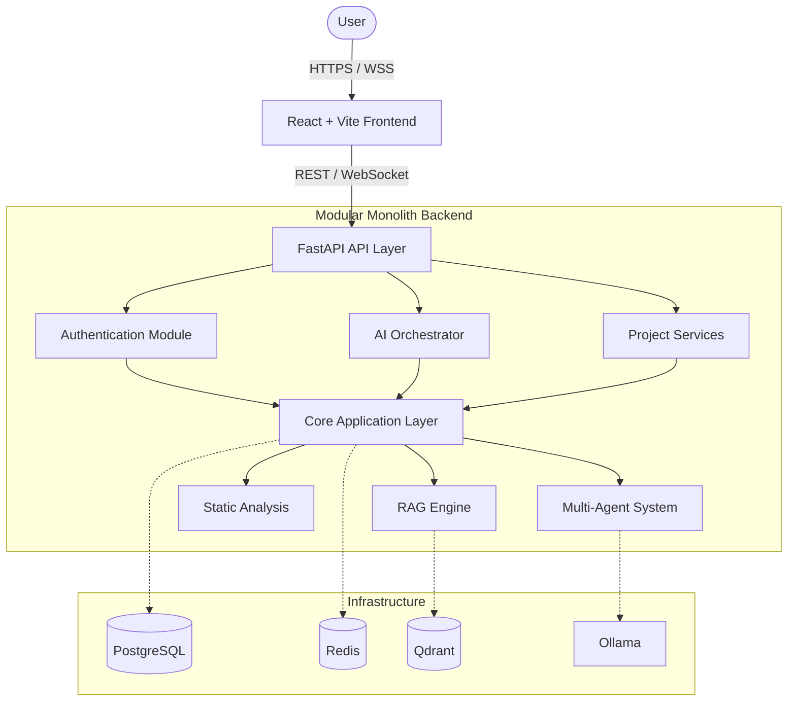
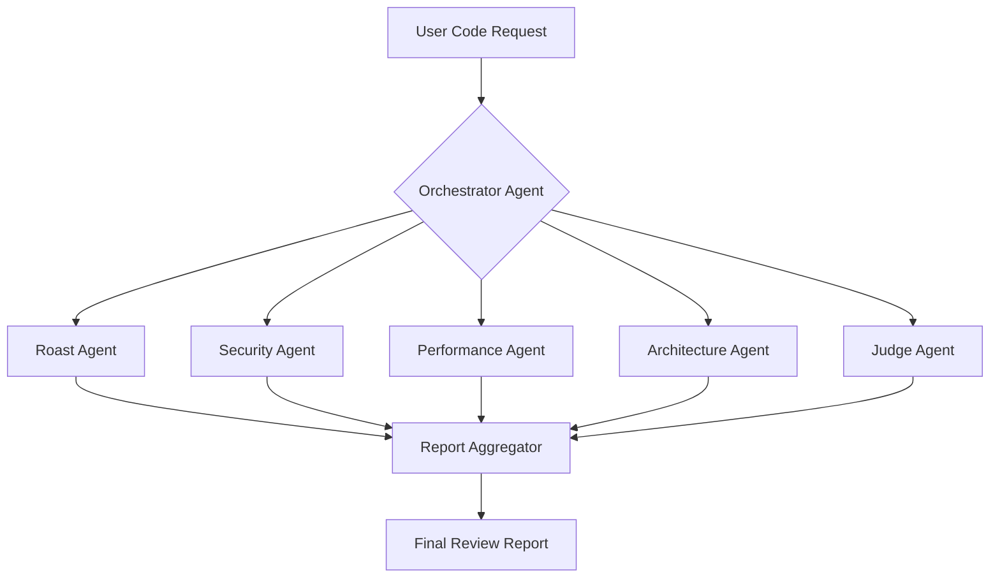
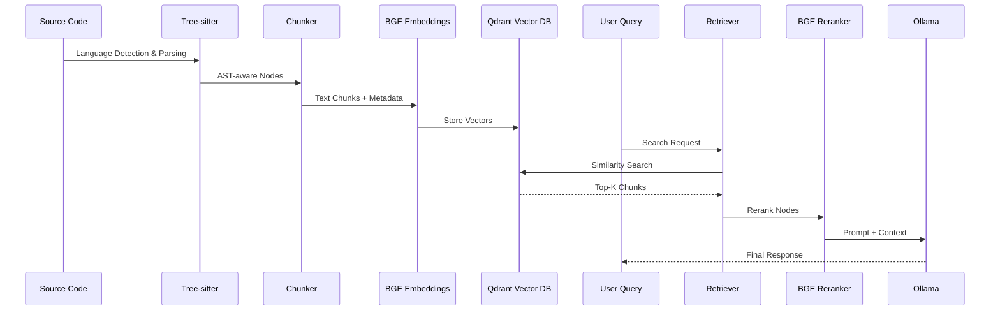
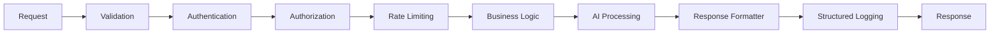

# RoastLab AI: Software Architecture & System Design Blueprint

This blueprint establishes the strict architectural boundaries, multi-agent AI orchestration pipelines, and data flow patterns for RoastLab AI. It acts as the ultimate reference for all future module development.

## 1. High-Level System Architecture



## 2. Clean Architecture Layers

RoastLab AI strictly adheres to Clean Architecture, enforcing the Dependency Rule (outer layers depend on inner layers).

1. **Presentation Layer (`app/api`):** FastAPI routers, WebSocket endpoints, request/response Pydantic models (DTOs). Contains ZERO business logic.
2. **Application Layer (`app/services`):** Use cases and orchestration. Coordinates the domain layer and infrastructure layer.
3. **Domain Layer (`app/models`, `app/core`):** Pure Python. Business rules, interfaces, and core entities. No knowledge of FastAPI or SQLAlchemy.
4. **Infrastructure Layer (`app/repositories`, `app/external`):** Implementations of domain interfaces. SQLAlchemy models, Alembic, Redis clients, Qdrant clients, LLM bindings.

## 3. Backend Modules

The system is a **Modular Monolith**. Modules communicate strictly through public interfaces/services, never through direct database access.

- **Authentication:** JWT, RBAC, session management.
- **Projects:** Repository/Codebase metadata and state.
- **Reviews:** Code review sessions, comments, and statuses.
- **RAG:** Document parsing, chunking, embedding generation.
- **Embeddings:** Vector embedding models (BAAI BGE).
- **Vector Search:** Qdrant similarity search orchestration.
- **Agents:** Orchestrator and specialized LLM agents.
- **Knowledge Base:** Internal documentation, codebase rules.
- **GitHub Integration:** Webhooks, PR fetching.
- **Notifications:** WebSocket and email alerts.
- **Analytics:** Telemetry and token usage metrics.
- **Health & Configuration:** Readiness probes, env management.

## 4. Multi-Agent AI Architecture



**Agent Contract:** Every agent implements a standard interface guaranteeing:
- Independent Prompt Template
- Strongly Typed Output Schema (Pydantic)
- Confidence Score (0.0 - 1.0)
- Execution Trace

## 5. RAG Pipeline



## 6. Request Lifecycle



## 7. Dependency Injection Strategy

FastAPI's `Depends()` will be used to inject resources into the Presentation layer. The Application layer will use standard Python constructor injection.
- **Singletons:** Global Configuration (`Settings`), LLM Clients, Vector DB Clients.
- **Request-Scoped:** Database Sessions (`AsyncSession`), Redis connections, Auth Contexts, Service instances.

## 8. Data Flow

- **Request Flow:** Strict top-down via Dependency Injection. Router -> Service -> Repository -> Database.
- **AI Processing Flow:** Asynchronous execution. Heavy AI tasks (RAG indexing, deep reviews) yield `task_id` to client and execute via background workers (or async `asyncio.create_task` initially), emitting progress over WebSockets.
- **Logging Flow:** All exceptions bubble up to a global exception handler. `structlog` captures context (request ID, user ID) at the middleware level and injects it into all child logs.

## 9. Error Handling Strategy

Centralized Exception Handlers in FastAPI:
- `RequestValidationError` -> Maps to standard 422 API response.
- `CustomDomainException` -> Base class for all business errors (e.g., `ResourceNotFoundException`, `UnauthorizedException`). Mapped to specific HTTP codes.
- `AIFailureException` -> Handles LLM timeouts, parsing failures, and fallback logic.

**API Response Format (Enforced):**
```json
{
    "success": false,
    "message": "Validation failed.",
    "errors": [{"field": "code_snippet", "msg": "Cannot be empty"}],
    "metadata": {"timestamp": "2026-07-07T10:00:00Z", "requestId": "req-123"}
}
```

## 10. Configuration Strategy

- Values originate from `.env` files.
- `pydantic-settings` parses and validates these values on startup into a global `Settings` object.
- The `Settings` object is injected into services that require configuration.
- **Zero direct `os.getenv()` calls** allowed in business or infrastructure logic.

## 11. Observability

- **Structured Logging:** `structlog` outputs JSON logs in production, including `request_id`, `module`, and `latency`. No standard `print()` allowed.
- **AI Telemetry:** LLM calls log token usage, latency, and prompt/completion sizes to monitor inference costs and performance.
- **Health Probes:** Dedicated `/health` and `/ready` endpoints verifying DB, Redis, Qdrant, and Ollama connectivity.

## 12. Security Architecture

- **Auth:** JWT access tokens (short-lived) + HttpOnly refresh tokens (long-lived).
- **RBAC:** Role-based access control middleware (Admin, User, Pro).
- **Protection:** 
  - Rate Limiter via Redis (sliding window).
  - CORS strict origins.
  - LLM Prompt Injection protection via specialized validation agents.
  - Secret Detection before storing source code chunks.

## 13. Database Design Principles

- **Primary Keys:** UUID4 exclusively.
- **Auditing:** `created_at` and `updated_at` (auto-updating via SQLAlchemy events) on every table.
- **Deletions:** Soft deletes via `is_deleted` boolean flag to preserve historical review contexts.
- **Migrations:** Managed entirely by Alembic. No raw DDL.

## 14. API Standards

- All routes nested under `/api/v1`.
- Input validation via Pydantic v2 schemas.
- Output serialization via Pydantic v2 schemas.
- Comprehensive OpenAPI descriptions (Swagger UI).

## 15. Scalability Plan

The **Modular Monolith** pattern ensures that boundaries between `Auth`, `Agents`, `RAG`, and `Projects` are strictly defined through interfaces. If inference or vector search requires independent scaling in the future, the `RAG` and `Agents` modules can be seamlessly detached into standalone microservices communicating via gRPC or message queues (RabbitMQ/Kafka) without rewriting domain logic.
